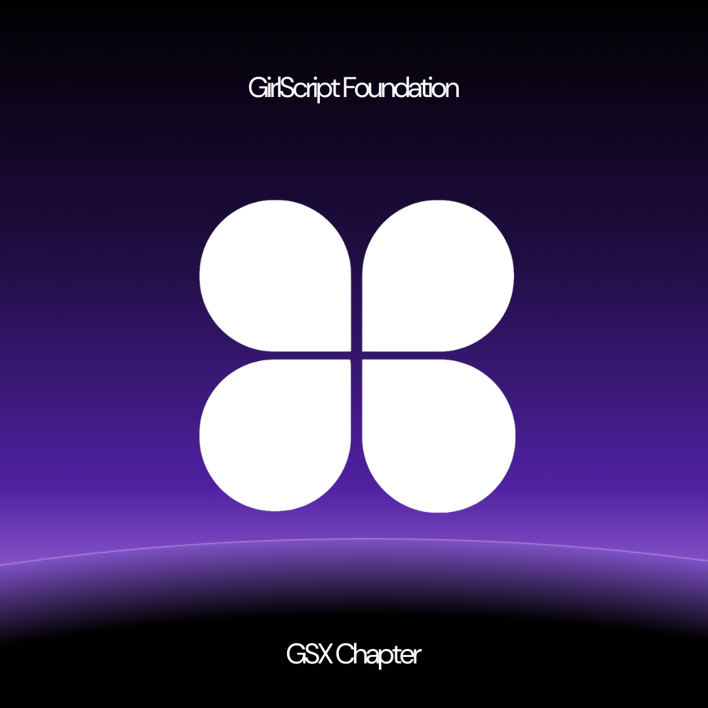
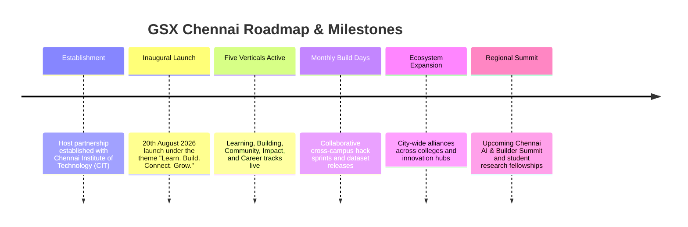

<div align="center">

  

  # GSX Chennai Chapter
  ### **Learn. Build. Connect. Grow.**

  *The official student extension of GirlScript Foundation, hosted at Chennai Institute of Technology (CIT).*

  <p align="center">
    <a href="https://chat.whatsapp.com/HfxItPkZAgeDtdKut2qgfr?s=cl&p=a&ilr=0"></a>
    <a href="https://forms.gle/AFdmVVLug64CURiq9"></a>
    <a href="https://www.linkedin.com/company/gsx-chennai-chapter"></a>
    <a href="https://www.instagram.com/gsx_chennai_chapter/"></a>
  </p>

  <p align="center">
    
    
    
    
    
    
    
  </p>

</div>

---

## 📖 Table of Contents

- [About GSX Chennai](#-about-gsx-chennai)
- [The Five Operating Verticals](#-the-five-operating-verticals)
- [Key Web Portal Features](#-key-web-portal-features)
- [Tech Stack Architecture](#-tech-stack-architecture)
- [Project Structure](#-project-structure)
- [Getting Started](#-getting-started)
  - [Prerequisites](#prerequisites)
  - [Installation](#installation)
  - [Environment Variables](#environment-variables)
  - [Running the Development Server](#running-the-development-server)
  - [Production Build & Preview](#production-build--preview)
- [Available Scripts](#-available-scripts)
- [Core Team & Leadership](#-core-team--leadership)
- [Collaboration & Opportunities](#-collaboration--opportunities)
- [Community Journey & Milestones](#-community-journey--milestones)
- [Contributing](#-contributing)
- [Connect & Community Channels](#-connect--community-channels)
- [License & Acknowledgments](#-license--acknowledgments)

---

## 🌟 About GSX Chennai

**GSX Chennai** is an open, high-impact technical community for developers, designers, researchers, and innovators across Chennai. As an official student extension of the **[GirlScript Foundation](https://www.girlscript.tech/)**, the chapter is anchored at **[Chennai Institute of Technology (CIT)](https://www.citchennai.edu.in/)** as its institutional host.

Our mission is to create an open technical sanctuary where students and developers don't just consume technology, but learn it, build with it, and contribute back to open ecosystems. We bridge the gap between traditional academic curriculums and the rapid advancements of real-world industry practices.

> *"A community doesn't exist because of a logo, a chapter, or a social media page. It exists because people show up."*  
> — *From the Chapter Lead's Inaugural Address*

---

## 🏛️ The Five Operating Verticals

The chapter operates across five core verticals designed to provide end-to-end technical and professional growth:

| Vertical | Focus & Purpose | Key Initiatives |
| :--- | :--- | :--- |
| 🎓 **Learning** | Deep-dive hands-on technical education | Study circles, developer bootcamps, masterclasses, AI/ML study tracks, and educator enablement |
| 🛠️ **Building** | Shipping real-world products & code | Open-source contributions, curated datasets, autonomous AI agents, hackathons, and Build Days |
| 👥 **Community** | Cultivating high-trust developer networks | In-person technical meetups, lightning talks, research paper reading pods, and cross-college mixers |
| 🤝 **Impact** | Grassroots tech enablement for society | School outreach, NGO digital literacy missions, and local-language / vernacular open tools |
| 🚀 **Career** | Real-world industry readiness & employment | Technical interview prep clinics, certification roadmaps, resume reviews, fellowships, and referrals |

---

## ✨ Key Web Portal Features

The official web application represents the digital headquarters of GSX Chennai:

- 🧭 **Multi-Page Experience**: Instant, hash-synchronized navigation across `Home`, `About`, `Team`, `Events`, `Announcements`, `Projects`, and `Get Involved`.
- 🌓 **Dynamic Theme Engine**: Seamless toggle between Dark Mode and Light Mode with persistent `localStorage` memory and system-theme preference detection.
- 🗂️ **Interactive Modals & Workflows**:
  - **Join Community Modal**: Step-by-step onboarding flow with direct links to the official Google Form & WhatsApp community.
  - **Collaboration Inquiry Form**: Full-featured partnership dispatch for enterprises, NGOs, colleges, and mentors.
  - **Digital Brochure Modal**: Interactive multi-page chapter prospectus with animated slide-based navigation.
  - **Project Submission & Showcase**: Modal for student creators to submit open-source repos, AI models, and web apps.
  - **Event Registration & Details**: Dedicated view for upcoming hackathons, speaker sessions, and workshops.
- 🎨 **State-of-the-Art Motion & Aesthetics**:
  - Micro-interactions and spring animations powered by `motion/react` (Framer Motion).
  - Ambient radial hero glow backdrops and interactive canvas particle fields.
  - Custom branded cursor tracking with smooth physics.
  - Viewport-triggered scroll reveals and animated metric counters.
- 🤖 **AI Studio & Gemini Integration**: Powered by `@google/genai` (Google Gemini 2.0 / 2.5 Flash SDK) for intelligent assistant features and project insights.
- 📱 **Fully Responsive Design**: Optimized across mobile, tablet, laptop, and ultra-wide displays using Tailwind CSS v4.

---

## 🛠️ Tech Stack Architecture

### **Frontend & Framework**
- **[React 19](https://react.dev/)**: Latest concurrent React features, hooks, and optimal DOM rendering.
- **[TypeScript 5.8](https://www.typescriptlang.org/)**: Strict type safety, clean interfaces, and scalable contracts.
- **[Vite 6](https://vite.dev/)**: Next-generation frontend tooling with lightning-fast HMR and bundling.

### **Styling & Icons**
- **[Tailwind CSS v4](https://tailwindcss.com/)**: Cutting-edge CSS engine with `@tailwindcss/vite` integration.
- **[Lucide React](https://lucide.dev/)**: Clean, modern, and accessible feather-style vector icons.
- **[clsx](https://github.com/lukeed/clsx) & [tailwind-merge](https://github.com/dcastil/tailwind-merge)**: Utility classes management without specificity collisions.

### **Animations & UX**
- **[Framer Motion / Motion](https://motion.dev/)**: Complex spring physics, scroll reveals, exit transitions, and modal choreographies.
- **Custom Interactive Elements**: Custom cursor canvas, ambient particles, and animated counters.

### **AI & Services**
- **[@google/genai](https://www.npmjs.com/package/@google/genai)**: Official Google GenAI SDK for Gemini models.
- **Express.js**: Lightweight production serving and preview utility.

---

## 📁 Project Structure

```bash
gsx-chennai-chapter/
├── public/                     # Static public assets
│   ├── chapter-logo.png        # Official GSX Chennai Chapter emblem
│   ├── gsx-logo.png            # Main GSX branding
│   ├── gsx-logo-purple.png     # Accent logo variant
│   ├── chennai-hero-bg.jpg     # Hero background image
│   └── team/                   # Team member portraits and photos
├── src/
│   ├── components/             # Reusable UI & modal components
│   │   ├── AnimatedCounter.tsx           # Count-up animation on viewport scroll
│   │   ├── AnnouncementDetailModal.tsx   # Detailed view for chapter news
│   │   ├── BrochureModal.tsx             # Interactive digital chapter prospectus
│   │   ├── CollaborationInquiryForm.tsx  # Partner inquiry intake form
│   │   ├── CustomCursor.tsx              # Interactive spring-based cursor
│   │   ├── EventDetailModal.tsx          # Event schedule and speaker lineup
│   │   ├── EventRegisterModal.tsx        # Event RSVP & registration modal
│   │   ├── Footer.tsx                    # Chapter footer with socials & quick links
│   │   ├── HeroGlow.tsx                  # Ambient radial blur lighting effects
│   │   ├── HeroParticles.tsx             # Interactive canvas particle field
│   │   ├── JoinCommunityModal.tsx        # Quick community onboarding modal
│   │   ├── Navbar.tsx                    # Responsive navigation with active route sync
│   │   ├── ProjectDetailModal.tsx        # Showcase deep-dive for student projects
│   │   ├── ScrollReveal.tsx              # Viewport reveal transition wrapper
│   │   ├── SubmitProjectModal.tsx        # Student project submission interface
│   │   └── ThemeToggle.tsx               # Light/Dark mode switcher
│   ├── context/
│   │   └── ThemeContext.tsx    # Theme provider and persistent state manager
│   ├── data/                   # Structured content & static databases
│   │   ├── announcements.ts    # Chapter updates, press, and notices
│   │   ├── events.ts           # Past, ongoing, and upcoming events
│   │   ├── journey.ts          # Timeline milestones from CIT inception to present
│   │   ├── opportunities.ts    # Vertical opportunities, benefits & partnerships
│   │   ├── projects.ts         # Community showcase repositories and apps
│   │   ├── stats.ts            # Key community metrics and pillars
│   │   └── team.ts             # Leadership profiles, charters & ownership areas
│   ├── pages/                  # Top-level view pages
│   │   ├── AboutPage.tsx       # Mission, story, values, and operating pillars
│   │   ├── AnnouncementsPage.tsx # News, notifications, and updates
│   │   ├── EventsPage.tsx      # Chapter events calendar and RSVP
│   │   ├── GetInvolvedPage.tsx # Opportunities for students, mentors & partners
│   │   ├── HomePage.tsx        # Landing hero, stats, pillars & featured content
│   │   ├── ProjectsPage.tsx    # Community project repository showcase
│   │   └── TeamPage.tsx        # Chapter leadership roster and roles charter
│   ├── types.ts                # TypeScript domain models and interfaces
│   ├── App.tsx                 # Core app root, modal orchestrator & hash router
│   ├── index.css               # Global theme tokens, typography & CSS animations
│   └── main.tsx                # React DOM entry point
├── .env.example                # Sample environment variables template
├── index.html                  # HTML entry point with metadata and fonts
├── package.json                # Project dependencies and npm scripts
├── tsconfig.json               # TypeScript compiler configuration
└── vite.config.ts              # Vite plugins and module aliases
```

---

## 🚀 Getting Started

Follow these instructions to set up the project locally on your machine.

### Prerequisites

- **Node.js**: `v18.0.0` or higher (recommended: `v20+` or `v22+`)
- **Package Manager**: `npm` (comes with Node.js), `pnpm`, or `yarn`

Verify your Node and npm versions:
```bash
node -v
npm -v
```

---

### Installation

1. **Clone the repository:**
   ```bash
   git clone https://github.com/nithinrv07/gsx-chennai-chapter.git
   cd gsx-chennai-chapter
   ```

2. **Install dependencies:**
   ```bash
   npm install
   ```

---

### Environment Variables

Create a `.env.local` file in the root directory by copying the sample:

```bash
cp .env.example .env.local
```

Populate the configuration values:

```ini
# Required for Gemini AI API functionality
GEMINI_API_KEY="your_gemini_api_key_here"

# The URL where your application is hosted (optional in local dev)
APP_URL="http://localhost:3000"
```

> 🔑 **Need a Gemini API Key?** You can generate one for free from **[Google AI Studio](https://aistudio.google.com/app/apikey)**.

---

### Running the Development Server

Start the Vite development server:

```bash
npm run dev
```

Open your browser and navigate to:
```
http://localhost:3000
```

The application features instant Hot Module Replacement (HMR). Any changes made to `src/` will reflect immediately in your browser.

---

### Production Build & Preview

1. **Build the production bundle:**
   ```bash
   npm run build
   ```
   This compiles and optimizes all assets into the `dist/` directory.

2. **Preview the production build locally:**
   ```bash
   npm run preview
   ```

---

## 📜 Available Scripts

| Command | Description |
| :--- | :--- |
| `npm run dev` | Starts the Vite development server at `http://localhost:3000` with host listening on `0.0.0.0` |
| `npm run build` | Compiles TypeScript and packages the project into optimized production assets in `dist/` |
| `npm run preview` | Runs a local web server to preview the built `dist/` distribution bundle |
| `npm run lint` | Runs the TypeScript compiler (`tsc --noEmit`) to validate type integrity |
| `npm run clean` | Cleans up the `dist/` output and temporary build files |

---

## 👥 Core Team & Leadership

The GSX Chennai Chapter is guided by student leaders and builders across Chennai:

<div align="center">

| Member | Role | Key Ownership & Focus | Profile |
| :--- | :--- | :--- | :---: |
| **Dedeepya Yakkala** | **Chapter Lead** | Overall direction, central partnerships, chapter reporting | [LinkedIn](https://www.linkedin.com/in/dedeepyayakkala) |
| **H Sujey** | **Co-Lead** | Logistics, venues, operations, event delivery | [LinkedIn](https://www.linkedin.com/in/sujey-hariprasad) |
| **Abinaya R** | **Build Owner** | Open source, datasets, hackathons, AI agents | [LinkedIn](https://www.linkedin.com/in/abinaya0333) |
| **Buvanagirish SK** | **Build Owner** | Repositories, open tooling, agentic architectures | [LinkedIn](https://www.linkedin.com/in/buvanagirish-sk-3b7ba8329/) |
| **Kameshwaran** | **Community Owner** | In-person meetups, lightning talks, reading pods | [LinkedIn](https://www.linkedin.com/in/kameshwaran-b-779363338/) |
| **Kaviya Sree N** | **Career Owner** | Tech interview prep, certifications, resume reviews | [LinkedIn](https://www.linkedin.com/in/kaviya-sree-n-a6293b380/) |
| **Minhu** | **Operation Lead** | Logistics, operations, venue coordination | [LinkedIn](https://www.linkedin.com/in/minhu-parthasarathy07/) |
| **Mithra** | **Comms Owner** | Digital media, broadcasts, promos & socials | [LinkedIn](https://www.linkedin.com/in/mithra-b-404111313/) |
| **Mohamed Shameel** | **Impact Owner** | School outreach, NGO digital literacy, vernacular tools | [LinkedIn](https://www.linkedin.com/in/mohamedshameel2006/) |
| **Raghunath Balaji** | **Learning Owner** | Study circles, bootcamps, technical enablement | [LinkedIn](https://www.linkedin.com/in/raghunath-balaji/) |
| **Semmozhi A** | **Learning Owner** | Learning sprints, educator sessions, mentorship | [LinkedIn](https://www.linkedin.com/in/semmozhi/) |

</div>

---

## 🤝 Collaboration & Opportunities

We actively welcome partnerships across the technology and education ecosystem:

- 🏢 **Companies & Startups**: Partner for talent recruitment pipelines, host specialized AI Build Days, sponsor hackathons, or engage through CSR skilling.
- 🏫 **Colleges & Universities**: Co-host inter-collegiate hackathons, technical speaker series, and faculty enablement workshops.
- 🌍 **NGOs & Civic Bodies**: Collaborate on digital literacy initiatives, vernacular translation tools, and grassroots community workshops.
- 🧑‍🏫 **Mentors & Industry Veterans**: Guide student engineering teams, judge hackathons, and lead masterclasses on emerging tech.

To initiate a collaboration, submit an inquiry through the **Get Involved** tab on the website or fill out our [Collaboration Form](https://forms.gle/AFdmVVLug64CURiq9).

---

## 🗺️ Community Journey & Milestones



---

## 🤝 Contributing

Contributions to the GSX Chennai Chapter web application and open-source initiatives are warmly welcomed!

1. **Fork the Repository**
2. **Create a Feature Branch:**
   ```bash
   git checkout -b feature/amazing-feature
   ```
3. **Commit your Changes:**
   ```bash
   git commit -m "feat: add amazing feature"
   ```
4. **Run Type Checking:**
   ```bash
   npm run lint
   ```
5. **Push to the Branch:**
   ```bash
   git push origin feature/amazing-feature
   ```
6. **Open a Pull Request** describing your changes and link any relevant issues.

---

## 🌐 Connect & Community Channels

Stay updated with our events, releases, and announcements:

- 💬 **WhatsApp Community**: [Join the Group](https://chat.whatsapp.com/HfxItPkZAgeDtdKut2qgfr?s=cl&p=a&ilr=0)
- 📝 **Membership Form**: [Register as a Member](https://forms.gle/AFdmVVLug64CURiq9)
- 💼 **LinkedIn**: [@gsx-chennai-chapter](https://www.linkedin.com/company/gsx-chennai-chapter)
- 📸 **Instagram**: [@gsx_chennai_chapter](https://www.instagram.com/gsx_chennai_chapter/)
- 🏛️ **Host Institution**: [Chennai Institute of Technology (CIT)](https://www.citchennai.edu.in/)

---

## 📄 License & Acknowledgments

- This project is open-source and licensed under the **MIT License**.
- Special thanks to the **[GirlScript Foundation](https://www.girlscript.tech/)** for community guidance and support.
- Heartfelt appreciation to **Chennai Institute of Technology (CIT)** leadership, faculty, and student organizers who make this community possible.

<div align="center">
  <sub>Built with ❤️ by the <b>GSX Chennai Chapter</b> community.</sub>
</div>

